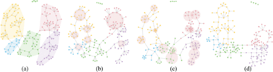

# Revisiting Stress Majorization as a Unified Framework for Interactive Constrained Graph Visualization

## Visualiztion

##  Intro
- SMACOF can be reformulated into a unified framework for both constrained and unconstrained graph visualizations
- devise various constraints to effec- tively explore the structures in sub-graphs of interest
- GPU-accelerated stress majorization

## Conclusion
SVやIPSepといったconstraint-basedな方法と比べて、同じような計算時間でよりよい、あるいは遜色のない結果が得られた

## References
[1] T.Dwyer.Scalable,versatileandsimpleconstrainedgraphlayout.Com- puter Graphics Forum, 28(3):991–998, 2009. doi: 10.1111/j.1467-8659.2009. 01449.x----

[2] T. Dwyer, Y. Koren, and K. Marriott. IPSep-CoLa: An incremental procedure for separation constraint layout of graphs. IEEE Trans. Vis. & Comp. Graphics, 12(5):821–828, 2006. doi: 10.1109/TVCG.2006.156

### Check list
- get image
-
