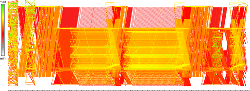

# Visualizing a Sequence of a Thousand Graphs (or Even More)

Date: 2018/12/10
## Visualization

## intro

既存手法:
グラフを二次元に配置する... 構造はよく反映されるが、時間ステップが大きいグラフには使えない

本手法では...  
目的: グラフな動的な振る舞いを見せること  
方法: 二部グラフを使う

## discussion
特に新しい多次元情報つきグラフ(multivariate graph)を可視化したわけではないけれど、グラフを詳細に調べるに当たっての出発点となるのではないか.

## conclusion
massive sequence view[1]とparallel edge splattingのアイデアを基に、scalableかつグラフの構造を表せる可視化手法を作った.

## reference
[1] VAN DENELZENS., HOLTEND., BLAASJ.,VANWIJKJ. J.:  Dynamic network visualization with extended massive sequenceviews.IEEE Transactions on Visualization and Computer Graphics 20,8 (2014), 1087–1099.